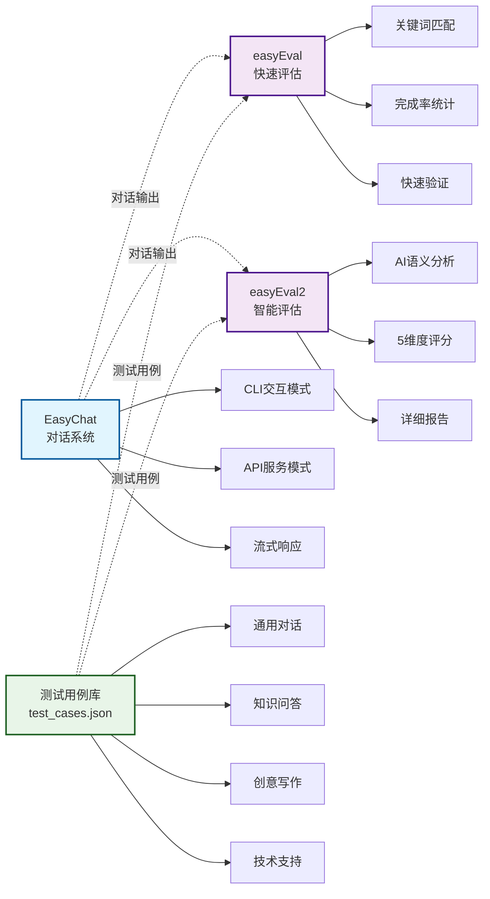
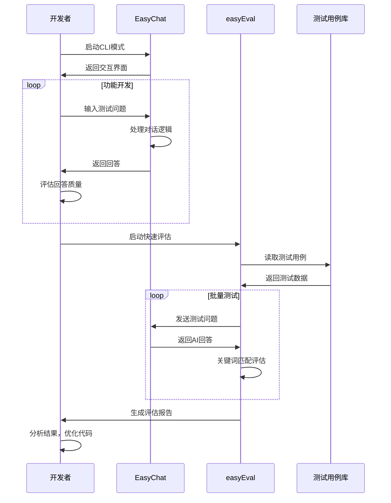
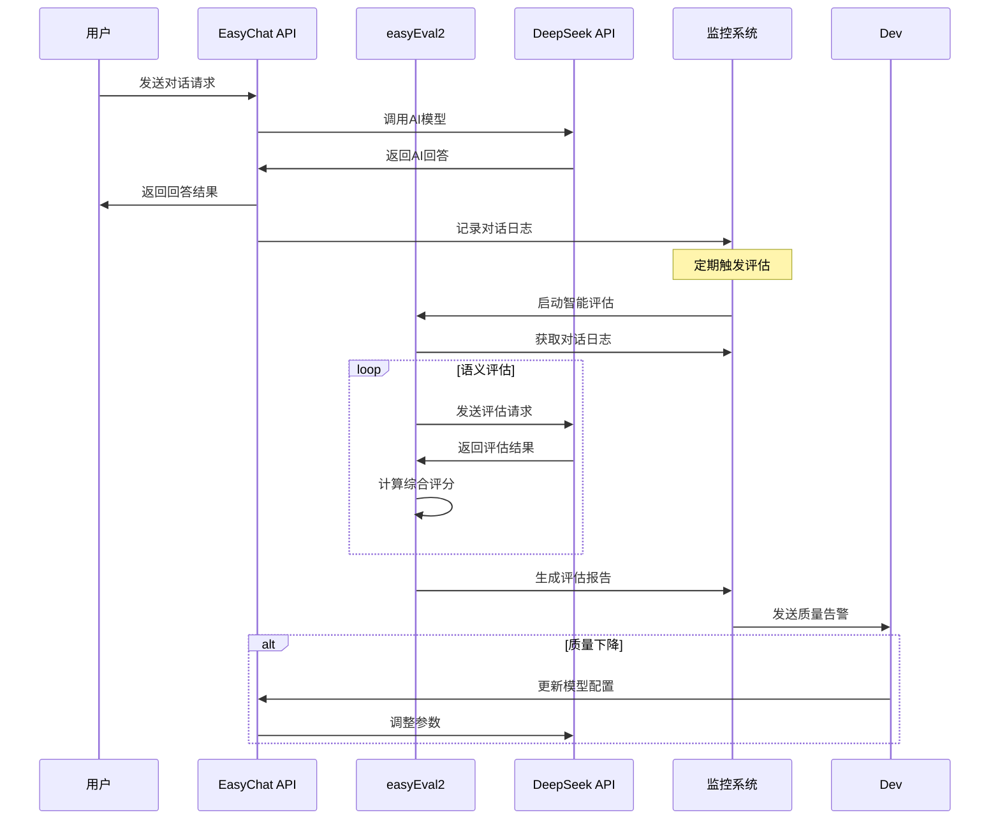
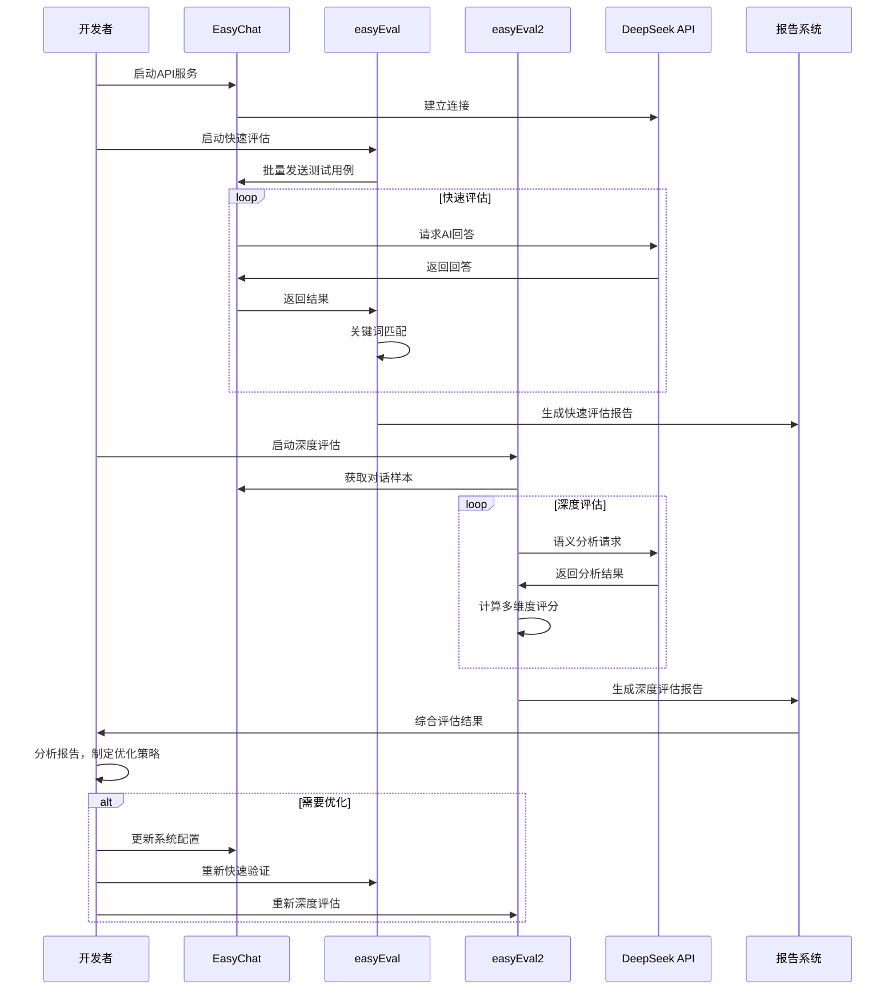

# AI对话系统评估器EasyEvaluator v0.1

[](https://github.com/Coldplay-now/EasyEvaluator/releases)
[](./LICENSE)
[](https://www.python.org/downloads/)
[](https://github.com/Coldplay-now/EasyEvaluator)
[](https://github.com/Coldplay-now/EasyEvaluator)
[](https://github.com/Coldplay-now/EasyEvaluator/blob/master/README.md#14-贡献)
[](https://github.com/Coldplay-now/EasyEvaluator/issues)
[](https://github.com/Coldplay-now/EasyEvaluator/stargazers)

一个完整的AI对话系统开发、部署和评估解决方案，包含对话系统本体和两套互补的评估工具。

## 1. 项目意图

本项目旨在构建一个完整的AI对话系统生态，包括：

1. **智能对话系统**：基于DeepSeek API的高质量对话服务
2. **快速评估工具**：基于关键词匹配的轻量级评估方案
3. **深度评估工具**：基于AI语义分析的高精度评估系统
4. **评估理论指南**：系统性的AI Agent评估方法论和最佳实践

通过这四个组件的协同工作，实现从开发、测试到生产的完整AI对话系统解决方案。

## 2. 项目展示

### 2.1 一键启动工具 (start.py)

本项目提供了统一的启动脚本 `start.py`，让您轻松管理和使用所有功能：

**交互式模式**（推荐新手使用）：
```bash
python start.py
```

**直接启动模式**（适合熟练用户）：
```bash
python start.py easychat              # CLI对话模式
python start.py easychat -- --api     # API服务模式
python start.py easyeval              # 快速评估
python start.py easyeval2             # 智能评估
python start.py easyeval2 -- --use-local-api # 本地API评估
```

**功能菜单**：
- 🗣️ **对话功能**：EasyChat CLI模式、API模式
- 📊 **评估功能**：easyEval快速评估、easyEval2智能评估
- 🔧 **工具功能**：环境检查、项目信息

### 2.2 系统交互概览


### 2.3 评估流程示例


## 3. Agent评估的基本概念

本项目基于系统性的AI Agent评估理论，详见 [AI Agent评估指南](./study.md)。该指南涵盖：

### 3.1 核心评估维度
- **能力与效果**：任务完成率、准确性、输出质量
- **效率与性能**：响应时间、资源消耗、成本控制
- **健壮性与可靠性**：异常处理、边界情况、稳定性
- **安全性与对齐**：内容安全、价值观对齐、风险控制

### 3.2 问答型Agent专项评估
针对对话系统的三大核心指标：
- **准确性（Accuracy）**：答案的正确性和相关性
- **响应效率（Efficiency）**：回答速度和系统吞吐量
- **用户体验（User Experience）**：交互自然度和满意度

### 3.3 评估方法论
- **人工评估**：专家审核、用户调研、A/B测试
- **自动评估**：指标计算、基准对比、语义分析
- **混合评估**：结合人工和自动方法的综合评估

通过理论指导实践，确保评估的科学性和有效性。

## 4. 项目结构

```
EasyEvaluator/
├── easychat/           # AI对话系统
│   ├── main.py         # 主程序（CLI + API模式）
│   ├── requirements.txt
│   └── README.md
├── easyEval/           # 快速评估工具
│   ├── src/eval.py     # 关键词匹配评估
│   ├── tests/test_cases.json
│   └── README.md
├── easyEval2/          # 智能评估工具
│   ├── main.py         # AI语义评估
│   ├── src/semantic_eval.py
│   └── README.md
├── study.md            # AI Agent评估理论指南
├── start.py            # 统一启动脚本
└── README.md           # 项目总览（本文件）
```

## 5. 子项目关联关系

### 5.1 核心架构图



### 5.2 工作流程

1. **开发阶段**：使用 EasyChat CLI模式进行功能开发和调试
2. **快速验证**：使用 easyEval 进行基础功能完整性检查
3. **深度评估**：使用 easyEval2 进行语义质量分析
4. **生产部署**：EasyChat API模式提供服务，定期使用评估工具监控质量

### 5.3 系统交互时序图

#### 5.3.1 EasyChat CLI模式时序图


#### 5.3.2 生产评估时序图


#### 5.3.3 完整评估流程时序图


## 6. 快速开始

### 6.1 一键启动（推荐）

我们提供了统一的启动脚本，让您轻松使用所有功能：

```bash
# 交互式模式 - 菜单选择功能
python start.py

# 直接启动模式
python start.py easychat              # CLI对话模式
python start.py easychat -- --api     # API服务模式
python start.py easyeval              # 快速评估
python start.py easyeval2             # 智能评估
python start.py easyeval2 -- --dry-run # 配置验证
```

### 6.2 环境准备

```bash
# 1. 克隆项目
git clone <repository-url>
cd trae0915_eval01

# 2. 创建虚拟环境（推荐）
python -m venv venv
source venv/bin/activate  # Linux/Mac
# 或 venv\Scripts\activate  # Windows

# 3. 安装各子项目依赖
cd easychat && pip install -r requirements.txt && cd ..
cd easyEval2 && pip install -r requirements.txt && cd ..
```

### 6.3 配置API密钥

在每个子项目目录下创建 `.env` 文件：

```bash
# DeepSeek API配置
DEEPSEEK_API_KEY=your_api_key_here
API_BASE_URL=https://api.deepseek.com/v1

# 本地API配置（可选，用于easyEval2）
LOCAL_API_BASE_URL=http://localhost:11434
LOCAL_API_MODEL=qwen2.5:7b
```

### 6.4 使用方法

#### 6.4.1 启动对话系统

```bash
cd easychat
pip install -r requirements.txt

# CLI交互模式
python main.py

# API服务模式（后台运行）
python main.py --api
```

#### 6.4.2 快速评估（开发阶段推荐）

```bash
cd easyEval
pip install -r requirements.txt

# 运行快速评估
python src/eval.py
```

#### 6.4.3 智能评估（生产阶段推荐）

```bash
cd easyEval2
pip install -r requirements.txt

# 使用本地API（免费）
python main.py --use-local-api --limit 10

# 使用DeepSeek API（高精度）
python main.py --use-deepseek-api --limit 5
```

## 7. 评估对比

| 特性 | easyEval | easyEval2 |
|------|----------|----------|
| **评估方式** | 关键词匹配 | AI语义分析 |
| **评估维度** | 完成率 | 5维度评分 |
| **评估速度** | 极快 | 中等 |
| **评估精度** | 基础 | 高级 |
| **成本** | 免费 | 本地免费/云端付费 |
| **报告格式** | JSON + TXT | JSON + Markdown |
| **适用场景** | 开发调试 | 生产监控 |
| **推荐用途** | 快速验证 | 深度分析 |

## 8. 技术栈

### 8.1 共同依赖
- **Python 3.8+**：主要开发语言
- **OpenAI SDK**：API客户端
- **python-dotenv**：环境配置管理
- **requests**：HTTP请求处理

### 8.2 EasyChat 特有
- **Flask**：Web API框架
- **流式响应**：实时对话体验

### 8.3 easyEval 特有
- **subprocess**：外部程序调用
- **tqdm**：进度条显示
- **关键词匹配**：快速评估算法

### 8.4 easyEval2 特有
- **Rich**：美观的终端界面
- **Pydantic**：数据验证
- **AI语义分析**：深度评估算法

## 9. 使用场景

### 9.1 开发阶段
1. 使用 **EasyChat CLI模式** 进行功能开发
2. 使用 **easyEval** 快速验证基础功能
3. 迭代优化对话逻辑

### 9.2 测试阶段
1. 启动 **EasyChat API服务**
2. 使用 **easyEval2 本地API模式** 进行详细评估
3. 分析评估报告，优化系统性能

### 9.3 生产阶段
1. 部署 **EasyChat API服务**
2. 定期使用 **easyEval2 DeepSeek API模式** 监控质量
3. 根据评估结果持续优化

### 9.4 全面评估
- 结合使用两套评估工具
- 获得多维度评估结果
- 确保系统质量和稳定性

## 10. 配置说明

### 10.1 API配置
- **DeepSeek API**：高质量对话和评估
- **本地API**：降低成本的评估方案
- **EasyChat API**：对话服务接口

### 10.2 测试用例
- **通用对话**：日常交流场景
- **知识问答**：专业知识查询
- **创意写作**：文本生成任务
- **技术支持**：问题解决场景

## 11. 开发指南

### 11.1 添加新的测试用例
1. 编辑 `tests/test_cases.json`
2. 按照现有格式添加测试用例
3. 运行评估验证效果

### 11.2 自定义评估维度
1. 修改 `easyEval2/config/prompts.py`
2. 调整评估提示词
3. 更新评分逻辑

### 11.3 扩展API功能
1. 修改 `easychat/main.py`
2. 添加新的API端点
3. 更新文档说明

## 12. 注意事项

1. **API密钥安全**：请妥善保管API密钥，不要提交到版本控制
2. **成本控制**：使用DeepSeek API时注意控制调用频率
3. **本地API**：推荐优先使用本地API进行开发和测试
4. **评估频率**：生产环境建议定期而非实时评估

## 13. 许可证

MIT License - 详见各子项目的LICENSE文件

## 14. 贡献

欢迎提交Issue和Pull Request来改进项目！

项目仓库：https://github.com/Coldplay-now/EasyEvaluator.git

## 15. 联系方式

如有问题或建议，请通过以下方式联系：
- 提交GitHub Issue：https://github.com/Coldplay-now/EasyEvaluator/issues
- 发送邮件至项目维护者

---

**项目状态**：活跃开发中 | **版本**：v0.1 | **最后更新**：2025年9月

**快速导航**：
- [EasyChat 对话系统](./easychat/README.md)
- [easyEval 快速评估](./easyEval/README.md)
- [easyEval2 智能评估](./easyEval2/README.md)