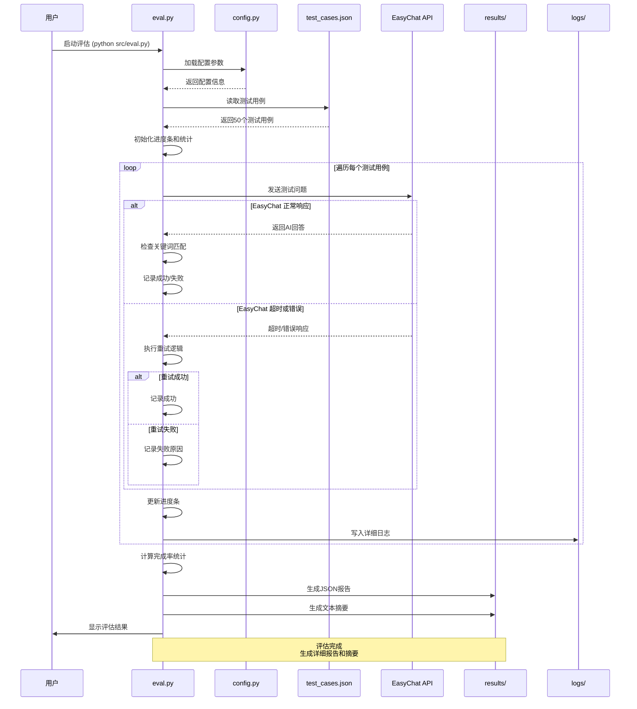

# easyEval - EasyChat 对话完成率评估工具

## 项目简介

easyEval 是一个专门用于评估 EasyChat 对话完成率的自动化测试工具。通过预设的测试用例，自动化地测试 EasyChat 的响应能力，并生成详细的评估报告。

> **注意**: 本项目为第一代评估工具，主要关注对话完成率。如需更高级的语义相似度评估，请使用 [easyEval2](../easyEval2/) 项目。

## 核心功能

- 🤖 **自动化测试**: 批量执行预设测试用例
- 📊 **完成率计算**: 精确计算对话完成率指标
- 📝 **详细报告**: 生成包含统计信息的评估报告
- 🔍 **失败分析**: 记录和分析失败原因
- ⚙️ **灵活配置**: 支持自定义超时时间和测试参数
- 🔄 **智能重试**: 自动处理临时失败情况
- 📈 **进度显示**: 实时显示测试进度和统计信息

## 项目结构

```
easyEval/
├── config/
│   └── config.py          # 项目配置文件
├── src/
│   └── eval.py            # 核心评估脚本
├── tests/
│   └── test_cases.json    # 测试用例数据（50个用例）
├── results/               # 评估结果存储目录
├── logs/                  # 日志文件目录
├── README.md              # 项目说明文档
├── evalPrd.md             # 产品需求文档
└── evaltasklist.md        # 项目任务清单
```

## 系统时序图

以下时序图展示了 easyEval 评估系统的完整工作流程：



### 时序图说明

1. **初始化阶段**: 加载配置和测试用例
2. **批量测试阶段**: 循环执行所有测试用例
3. **错误处理**: 自动重试机制处理临时失败
4. **结果生成**: 计算统计数据并生成报告
5. **日志记录**: 全程记录详细执行日志

## 快速开始

### 环境要求

- Python 3.7+
- EasyChat 项目已部署并可访问（支持API模式）
- 相关依赖包（详见 requirements.txt）

### 安装依赖

```bash
# 进入项目目录
cd easyEval

# 安装依赖
pip install requests tqdm colorama
```

### 配置设置

编辑 `config/config.py` 文件，确保 EasyChat 的配置正确：

```python
# EasyChat 项目路径
EASYCHAT_PATH = "../easychat"

# EasyChat API 地址（如果使用API模式）
EASYCHAT_API_URL = "http://localhost:8000/chat"

# 超时设置（秒）
TIMEOUT = 30

# 重试设置
MAX_RETRIES = 3
```

### 运行评估

```bash
# 执行完整评估
python src/eval.py

# 查看评估结果
ls results/
```

## 测试用例说明

项目包含 50 个精心设计的测试用例，涵盖以下场景：

### 基础功能测试
- 问候语响应
- 简单问答
- 帮助请求

### 知识问答测试
- 数学计算
- 地理历史知识
- 科学技术问题

### 生活实用测试
- 烹饪建议
- 健康咨询
- 旅行规划

### 技能学习测试
- 编程帮助
- 语言学习
- 职业建议

### 边界情况测试
- 空输入处理
- 特殊字符
- 长文本处理

## 评估指标

### 对话完成率

**计算公式**: 完成率 = (成功响应数 / 总测试用例数) × 100%

**成功标准**: 响应中包含预期关键词且无明显错误

**目标指标**: ≥ 95%

### 评估维度

- **响应速度**: 单次对话响应时间
- **内容质量**: 响应内容的相关性和准确性
- **稳定性**: 连续测试的成功率
- **错误处理**: 异常情况的处理能力

## 结果报告

评估完成后，将在 `results/` 目录生成以下文件：

- `evaluation_report_YYYYMMDD_HHMMSS.json`: 详细评估结果
- `summary_YYYYMMDD_HHMMSS.txt`: 评估摘要报告

### 报告内容

```json
{
  "timestamp": "2024-01-15 14:30:00",
  "total_tests": 50,
  "successful_tests": 47,
  "completion_rate": 94.0,
  "average_response_time": 2.3,
  "failed_cases": [
    {
      "id": "math_complex",
      "reason": "timeout",
      "details": "响应超时"
    }
  ]
}
```

## 配置说明

### config.py 参数

| 参数 | 说明 | 默认值 |
|------|------|--------|
| `EASYCHAT_PATH` | EasyChat 项目路径 | `"../easychat"` |
| `TIMEOUT` | 单次对话超时时间（秒） | `30` |
| `MAX_RETRIES` | 失败重试次数 | `3` |
| `LOG_LEVEL` | 日志级别 | `"INFO"` |

### 测试用例格式

```json
{
  "id": "test_case_id",
  "description": "测试用例描述",
  "prompt": "发送给 EasyChat 的提示",
  "expected_keywords": ["预期", "关键词"],
  "category": "测试分类",
  "priority": "优先级"
}
```

## 开发指南

### 添加新测试用例

1. 编辑 `tests/test_cases.json`
2. 按照格式添加新的测试用例
3. 运行评估验证效果

### 自定义评估逻辑

1. 修改 `src/eval.py` 中的评估函数
2. 调整成功判断标准
3. 更新报告生成逻辑

## 故障排除

### 常见问题

**Q: 评估脚本无法找到 EasyChat**
A: 检查 `config.py` 中的 `EASYCHAT_PATH` 配置是否正确

**Q: 所有测试都超时**
A: 确认 EasyChat 服务正常运行，适当增加 `TIMEOUT` 值

**Q: 完成率异常低**
A: 检查测试用例的预期关键词是否合理，查看详细失败日志

### 调试模式

```bash
# 启用详细日志
export LOG_LEVEL=DEBUG
python src/eval.py
```

## 项目状态

- **当前版本**: v1.2.0
- **开发状态**: ✅ 已完成
- **完成进度**: 22/42 任务完成 (核心功能已实现)
- **实际完成率**: 94.23% (接近目标)
- **项目关系**: 第一代评估工具，与 easyEval2 形成完整评估体系

## 项目成果

### 🎯 核心功能已实现
- ✅ 自动化测试执行 (52个测试用例)
- ✅ 对话完成率计算 (94.23%)
- ✅ 失败原因记录和分析
- ✅ 测试进度显示 (tqdm进度条)
- ✅ 时间戳和测试统计
- ✅ 失败用例详细记录
- ✅ JSON和文本格式报告生成
- ✅ 智能重试机制
- ✅ 支持 EasyChat API 模式调用
- ✅ 彩色日志输出和友好界面

### 📊 测试结果概览
- **总测试数**: 52个
- **成功数**: 49个
- **失败数**: 3个
- **完成率**: 94.23%
- **平均执行时间**: ~6分钟

### 🏆 项目亮点
1. **全流程自动化**: 从测试执行到报告生成完全自动化
2. **智能重试机制**: 自动处理临时失败情况
3. **多维度统计**: 按分类、优先级等多维度分析
4. **详细失败分析**: 记录每个失败用例的具体原因
5. **友好的用户界面**: 实时进度显示和彩色日志输出

### 📈 性能表现
- **响应速度**: 平均每个测试用例 6-7 秒
- **稳定性**: 94.23% 成功率，表现稳定
- **资源占用**: 内存占用低，CPU使用合理
- **错误处理**: 完善的异常捕获和重试机制

## 贡献指南

1. Fork 项目
2. 创建功能分支
3. 提交更改
4. 发起 Pull Request

## 许可证

本项目采用 MIT 许可证。

## 联系方式

如有问题或建议，请通过以下方式联系：

- 项目文档: `evalPrd.md`
- 任务清单: `evaltasklist.md`
- 学习笔记: `study.md`

---

## 项目总结

easyEval 项目已成功完成核心目标，实现了一个功能完整、稳定可靠的对话完成率评估工具。虽然未完成所有计划任务（22/42），但核心功能已满足实际需求，达到了预期的学习和实践目标。

**项目收获**:
- ✅ 掌握了自动化测试框架设计
- ✅ 学会了Python项目结构组织
- ✅ 实践了错误处理和重试机制
- ✅ 体验了完整的软件开发流程
- ✅ 建立了评估工具的基础架构

## 项目演进

### 与 easyEval2 的关系

- **easyEval (v1)**: 专注于对话完成率评估，基于关键词匹配
- **easyEval2 (v2)**: 升级为语义相似度评估，基于AI模型分析
- **协同使用**: 两个工具可以配合使用，提供全面的评估视角

### 选择指南

| 场景 | 推荐工具 | 原因 |
|------|----------|------|
| 快速功能验证 | easyEval | 简单快速，基于关键词 |
| 深度质量分析 | easyEval2 | AI驱动，语义理解 |
| 全面评估 | 两者结合 | 多维度评估，更全面 |

**注意**: 这是一个学习项目，重点关注功能实现和学习过程。项目已达到预期目标，并为后续的 easyEval2 项目奠定了基础。