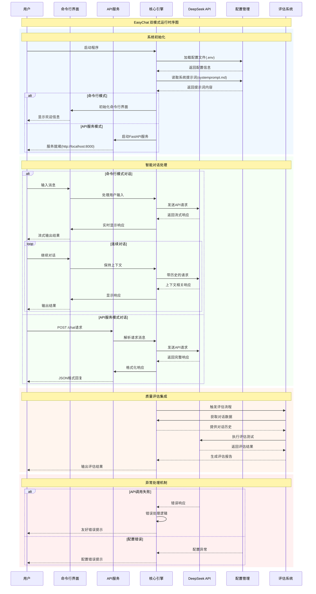

# EasyChat - DeepSeek AI 助手

一个基于 DeepSeek API 的智能命令行聊天程序，支持流式响应、连续对话和API服务模式。

## 功能特性

- 🤖 基于 DeepSeek API 的智能对话
- 💬 实时流式响应显示
- 🔄 支持连续对话，保持上下文
- 🌐 **API服务模式** - 支持HTTP API接口调用
- ⚙️ 灵活的配置管理
- 🛡️ 完善的错误处理机制
- 🚪 简单的退出命令（输入 `quit`）
- 📊 **集成评估系统** - 配合 easyEval 和 easyEval2 进行质量评估

## 系统时序图

### 双模式运行架构



### 核心特性说明

- **双模式架构**: 支持命令行交互和HTTP API服务两种运行模式
- **流式响应**: 命令行模式提供实时流式输出体验
- **上下文保持**: 支持连续对话，维护对话历史
- **配置灵活**: 通过.env文件和systemprompt.md实现灵活配置
- **评估集成**: 与easyEval系列工具深度集成，支持质量评估
- **错误处理**: 完善的异常处理机制，提供友好的错误提示

## 安装说明

### 1. 环境要求

- Python 3.6 或更高版本
- pip 包管理器

### 2. 安装依赖

```bash
cd easychat
pip3 install -r requirements.txt
```

### 3. 配置 API Key

编辑 `.env` 文件，填入你的 DeepSeek API Key：

```env
# DeepSeek API Key (必填)
DEEPSEEK_API_KEY=your_api_key_here

# API Base URL (可选，默认为 DeepSeek 官方地址)
API_BASE_URL=https://api.deepseek.com/v1
```

### 4. 自定义系统提示词（可选）

编辑 `systemprompt.md` 文件来自定义 AI 助手的行为规范和回复风格。

## 使用方法

### 启动程序

#### 命令行模式（默认）
```bash
python3 main.py
```

#### API服务模式
```bash
# 启动HTTP API服务
python3 main.py --api

# 服务将在 http://localhost:8000 启动
# API端点: POST /chat
```

### 使用示例

#### 命令行模式
```
==================================================
🤖 EasyChat - DeepSeek AI 助手
==================================================
输入 'quit' 退出程序
--------------------------------------------------

✅ 初始化完成，开始对话...

👤 你: 你好，请介绍一下自己
🤖 AI: 你好！我是一个基于 DeepSeek 的 AI 助手...

👤 你: quit

👋 再见！
```

#### API模式调用示例
```bash
# 发送聊天请求
curl -X POST http://localhost:8000/chat \
  -H "Content-Type: application/json" \
  -d '{"message": "你好，请介绍一下自己"}'

# 响应示例
{
  "response": "你好！我是一个基于 DeepSeek 的 AI 助手...",
  "status": "success"
}
```

### 退出程序

输入以下任一命令即可退出：
- `quit`
- `exit`
- `q`
- 或按 `Ctrl+C`

## 项目结构

```
easychat/
├── main.py              # 主程序文件（支持命令行和API模式）
├── .env                 # 环境配置文件
├── systemprompt.md      # 系统提示词文件
├── requirements.txt     # 依赖包列表
├── README.md           # 项目说明文档
├── prd.md              # 产品需求文档
├── prd2.md             # 产品需求文档v2（API模式）
├── tasklist.md         # 开发任务清单
└── up2_tasklist.md     # 升级任务清单
```

## 配置说明

### .env 文件配置项

| 配置项 | 说明 | 默认值 | 必填 |
|--------|------|--------|------|
| `DEEPSEEK_API_KEY` | DeepSeek API 密钥 | 无 | ✅ |
| `API_BASE_URL` | API 基础地址 | `https://api.deepseek.com/v1` | ❌ |
| `MODEL_NAME` | 模型名称 | `deepseek-chat` | ❌ |
| `MAX_TOKENS` | 最大 token 数 | `2000` | ❌ |
| `TEMPERATURE` | 温度参数 | `0.7` | ❌ |

### systemprompt.md 文件

该文件定义了 AI 助手的行为规范，包括：
- 基本原则和态度
- 回复风格和语调
- 专业能力描述
- 安全准则

## 常见问题

### Q: 程序启动时提示 "未找到 DEEPSEEK_API_KEY"

A: 请检查 `.env` 文件是否存在，并确保已正确填入 API Key。

### Q: 程序提示 "未找到 systemprompt.md 文件"

A: 这是警告信息，程序会使用默认系统提示词继续运行。如需自定义，请创建该文件。

### Q: API 调用失败怎么办？

A: 请检查：
1. API Key 是否正确
2. 网络连接是否正常
3. API 配额是否充足

### Q: 如何获取 DeepSeek API Key？

A: 访问 [DeepSeek 官网](https://platform.deepseek.com/) 注册账号并获取 API Key。

## 技术栈

- **Python 3.x** - 主要编程语言
- **OpenAI SDK** - API 调用库（兼容 DeepSeek API）
- **FastAPI** - Web框架（API模式）
- **uvicorn** - ASGI服务器
- **python-dotenv** - 环境变量管理
- **requests** - HTTP 请求库

## 开发说明

本项目采用简单的单文件架构，便于学习和理解。主要模块包括：

- 配置管理模块
- API 调用模块
- 流式输出处理
- 命令行界面
- **HTTP API服务** - 支持外部系统集成
- 错误处理机制

### API接口说明

#### POST /chat
发送聊天消息并获取AI回复

**请求格式**:
```json
{
  "message": "用户消息内容"
}
```

**响应格式**:
```json
{
  "response": "AI回复内容",
  "status": "success"
}
```

**错误响应**:
```json
{
  "error": "错误描述",
  "status": "error"
}
```

## 许可证

本项目仅供学习和研究使用。

## 更新日志

### v2.0.0
- ✅ **API服务模式** - 支持HTTP接口调用
- ✅ **双模式运行** - 命令行和API服务
- ✅ **集成评估** - 配合评估系统使用
- ✅ FastAPI框架集成
- ✅ 完善的API文档

### v1.0.0
- ✅ 基础聊天功能
- ✅ 流式响应显示
- ✅ 配置文件管理
- ✅ 错误处理机制
- ✅ 连续对话支持

---

如有问题或建议，欢迎提出 Issue 或 Pull Request！